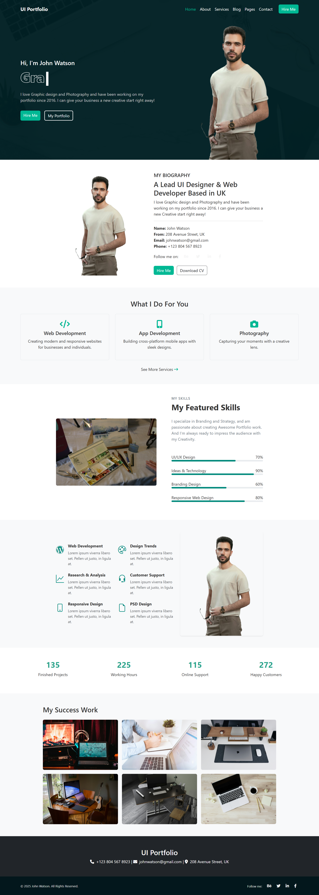

# UI Portfolio - John Watson



A modern, responsive portfolio website for UI/UX designers and web developers. This project showcases my skills, services, and portfolio work with a clean, professional design.

## Features

Modern UI Design: Clean, professional layout with attention to detail
  Fully Responsive: Works on all device sizes
  Interactive Elements:
  - Animated typing effect in the hero section
  - Smooth scrolling navigation
  - Hover effects on cards and buttons
  Well-Organized Sections:
  - Hero section with call-to-action
  - About/Biography section
  - Services offered
  - Skills with progress bars
  - Portfolio gallery
  - Contact information
  Performance Optimized: Fast loading times

## Technologies Used

Frontend:
  - HTML5, CSS3
  - Bootstrap 5 (for responsive layout)
  - Font Awesome & Bootstrap Icons
  - Typed.js (for typing animation)
Design:
  - Custom CSS with SASS-like organisation
  - Mobile-first approach
  - CSS transitions and animations

## Installation

This is a static website that requires no server or database setup. To run locally:

1. Clone the repository:
   ```bash
   git clone https://github.com/yourusername/ui-portfolio.git

2. Navigate to the project directory:
   ```bash
   cd ui-portfolio

## Project Structure
ui-portfolio/

├── index.html        

├── css/

└── style.css         # Custom styles

├── images/               # All project images


└── READMe.md       

## Credits
Bootstrap - CSS Framework

Font Awesome - Icons

Typed.js - Typing animation

Unsplash - For sample images

## Team Members
#### Tosin Williams
#### Email: richydainty.ot@gmail.com
#### Phone: +2348101078954

#### Richard Akintunde
#### Email: akintunderichard28@gmail.com
#### Phone: +2348033664299

## License
This project is open source and available under the MIT License.

## Live Demo Link:
![Project Live Demo]

## Contact
### For questions or customization requests, please contact:

#### Richard Akintunde
#### Email: akintunderichard28@gmail.com
#### Phone: +2348033664299

#### Tosin Williams
#### Email: richydainty.ot@gmail.com
#### Phone: +2348101078954
